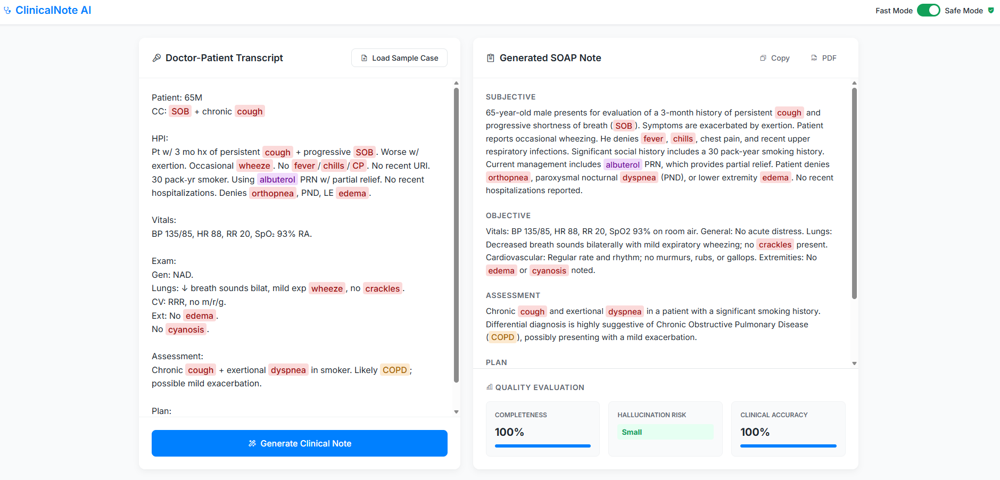

# 🩺 Clinical Documentation AI Assistant

A premium, front-end web application simulating an enterprise healthcare SaaS tool (similar to interface workflows used in Epic or Athenahealth). 

This project demonstrates clean architecture, dynamic DOM manipulation, and real-time Natural Language Processing (NLP) mock-logic. It takes aggressively unstructured doctor-patient transcripts and utilizes either a mathematical clustering algorithm or a live connection to the **Google Gemini Pro AI** to structure the output perfectly into a compliant SOAP note.

## ✨ Features
- **Dynamic Data Highlighting:** Uses regular expressions with word boundary isolation to hunt down and visually color-code critical medical entities (medications, symptoms, diagnoses) instantly as the user types.
- **Stateful Sequence Parsing:** Analyzes completely unformatted "scribbles", splitting them down to the grammatical sentence level, scoring them against an internal clinical heuristic, and piping them dynamically to their respective Subjective, Objective, Assessment, or Plan UI buckets.
- **Enterprise Design System:** Built entirely with Vanilla HTML/JS and pure CSS, utilizing dynamic HSL custom properties (`:root`), fluid Flexbox/Grid systems, and tactile micro-animations for a lightning-fast "no load" feel.
- **Native Print Export:** Employs specifically targeted `@media print` CSS directives to instantly hijack the active Document Object Model and layout a clean, PDF-ready medical record—safely hiding the interactive UI arrays.
- **Bifurcated Model Architecture:** Runs 100% securely and locally via a simulated NLP classifier, but contains a live `fetch` endpoint fully structured to interface with actual LLMs.

## 🤖 Connect the Live Gemini AI (Optional)
By default, this application safely falls back to a simulated mathematical parser so it requires absolutely zero installations or dependencies to run directly in your browser. However, the data pipeline is currently natively wired and ready to interact with live Google Generative AI endpoints!

To flip the switch and power this UI with an actual Large Language Model:
1. Go to **[Google AI Studio](https://aistudio.google.com/)** and log in with your Google account.
2. Click **"Get API key"** in the top left and generate a new key (it takes a few seconds and is 100% free).
3. Open the `script.js` file and look at **Line 6**. 
4. Safely paste your key inside the empty quotes like this:
   `const API_KEY = "AIzaSy_YOUR_API_KEY_HERE...";`
5. Save the file and refresh your browser window. 

The next time you click **Generate Clinical Note**, you can right-click and "Inspect" your browser console to verify the live REST payload is being securely zipped to Google servers!
